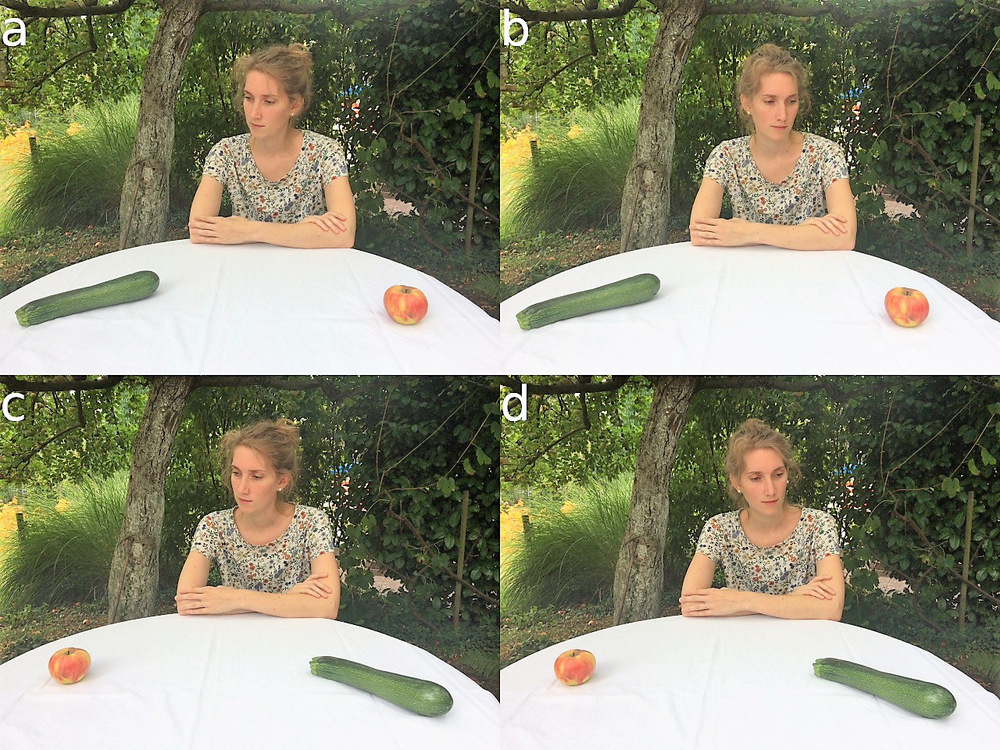

```{r setup chunks, echo=FALSE}

knitr::opts_chunk$set(echo = FALSE, include = FALSE, warning = FALSE)

add_epsilon <- function(apa_print_full_result, epsilon){

  str_c(
      str_split_fixed(apa_print_full_result, "\\$p", 2)[1],
      str_c("$\\epsilon = ", as.character(round(epsilon,2)), "$, $p"), #GG-
      str_split_fixed(apa_print_full_result, "\\$p", 2)[2])

}

```


```{r load packages and data}

source("../02_scripts/01-libraries.R")
source("../02_scripts/02-paths.R")
source(path(path_scripts_data, "eyetracking.R"))
source(path(path_scripts_data, "memory.R"))
source(path(path_scripts_data, "questionnaire.R"))
source(path(path_scripts_data, "rois.R"))

source(path(path_scripts_analysis, "plt_cosmetics.R")) # layout plots

```

# Introduction

Humans in their social environment rely on the information conspecifics provide.
This does not only hold for reading explicit signals, such as verbal
communication, but also for implicit signals, such as eye gaze or nonverbal
cues. Specifically, if an individual looks into a certain direction, this
information is often read spontaneously by an observer who redirects his or her
attention towards the referred object or location. Such guidance of someone
else’s attention is called gaze following. As a consequence, joint attention is
established.

<!-- gaze cuing to joint attention & social attention -->

The most frequently used paradigm to investigate such attentional shifts is the
so-called gaze cueing paradigm [@Friesen1998; @Driver1999; @Langton2000; for a
review see @Frischen2007a]. This paradigm has been inspired by classical studies
on spatial attention by @Posner1980 and consists of a centrally presented face
with varying gaze directions. This face is then followed by a subsequently
presented target at either the cued location (i.e., the location that the face
is looking at) or an uncued location (i.e., a location that is not being looked
at by the face). Studies using this gaze cueing paradigm have demonstrated that
gaze cues facilitate target processing as evident in smaller reaction times to
targets at cued as compared to uncued locations [@Frischen2007a]. The paradigm
was also used to show that gaze following is shaped by high-level social
cognitive processes like group identity [@Liuzza2011], theory-of-mind
[@Cole2015; @Teufel2009; @Wiese2012; @Wykowska2014] or physical self-similarity
[@Hungr2012].

<!-- critique -->

However, even though gaze cues are crucial for joint attention, this standard
gaze cueing paradigm can be criticized for lacking ecological validity. Whereas
in the real world, gaze signals occur within a rich context of competing visual
information, gaze cueing studies typically used isolated heads [@Friesen1998;
@Langton2000] or even cartoon faces [@Driver1999; @Ristic2005] as gaze cues [for
an overview see: @Risko2012]. Although gaze cueing was also found with more
naturalistic stimuli [@Perez-Osorio2015], in a recent study in which
@Hayward2017 compared attentional measures of gaze following from laboratory
(classical gaze cueing) and real world (real social engagement) settings, they
did not find reliable links between those measures.

<!-- social attention -->

As a compromise between rich but also less controlled field conditions and
standardized but impoverished laboratory studies, complex naturalistic scenes
were used to investigate gaze behavior in laboratory settings [e.g.,
@Fletcher-Watson2008; @Zwickel2010; @Perez-Osorio2015]. To specifically explore
the influence of gaze cues, @Zwickel2010 and @Perez-Osorio2015 used pictures of
a person (instead of isolated heads or faces) as a directional cue within a
naturalistic scene. @Zwickel2010 [in contrast to the gaze cueing task chosen by
@Perez-Osorio2015] used a free viewing instruction, meaning that participants
had no explicit task to fulfill but should just freely explore the pictures. The
authors argued that the lack of a specific task puts gaze following to a
stricter test since previous studies frequently used target detection tasks
[e.g., @Langton2017] or comprised specific instructions such as asking
participants to understand a scene [@Castelhano2007]. Consequently, in those
latter studies, it remains unclear to what degree gaze following occurred
spontaneously or was caused by the specific task at hand. In detail,
@Zwickel2010 presented participants multiple 3D rendered outdoor and indoor
scenes for several seconds that always included two clearly visible objects as
well as either a person or a loudspeaker that was directed towards one of these
objects. The loudspeaker, which also represents an object with a clear spatial
orientation, served as a control condition to ensure that gaze cueing effects
are due to the social meaning (i.e., the direction of the depicted person’s
gaze) as compared to a mere following of any directional cue. The results of the
study showed that participants fixated the cued object remarkably earlier, more
often and longer than the uncued object. By showing that leaving saccades from
the head most often landed onto the cued object, the results gave further
evidence for the direct influence of eye gaze on attentional guidance.
Crucially, similar effects were not obtained for the loudspeaker. The cued
objects were not just focused because they might have been salient by themselves
(e.g., due to positioning), or because they were cued by another object, but
became more salient by the person's reference. To sum up, @Zwickel2010 provide
convincing evidence that joint attention is a direct consequence of gaze cues
and gaze following, it happens spontaneously and has high relevance even in
situations that are more naturalistic (i.e., involve complex scenes and the
absence of explicit tasks) than classical gaze cueing studies based on
variations of the Posner paradigm.

<!-- research question -->

In the current study, we were first interested in whether the previously
reported effects hold when using a different set of stimuli. Replication in
itself is a core concept of scientific progress [@Schmidt2009] and thus relevant
for assessing the stability of effects. Nevertheless, our motivation was also to
improve certain aspects of the study and at the same time extending this line of
research. Due to their low resolution and reduced richness of details, the 3D
rendered scenes used by @Zwickel2010 did not allow for an assessment of the
depicted person’s gaze direction. As a consequence, the observed cueing effects
could be due to directional information inferred from both the body and head of
the person. We therefore developed a new set of photographic stimuli that had
sufficient resolution to also allow for perceiving gaze direction with clearly
visible eyes of the depicted person. These photos always included a human being
who directed his/her gaze towards one of two objects that were placed within
reaching distance. In order to be consistent with the study of @Zwickel2010, the
depicted person’s head and body were congruently aligned with his/her eye gaze.
Second, in order to extend this line of research, we manipulated top-down
attentional processes by task instruction to explore the susceptibility of gaze
following effects in naturalistic scenes. Earlier research showed that social
attention can be influenced by multiple factors like social status of the
observed persons [@Foulsham2010], possibility to interact [@Laidlaw2011;
@Hayward2017] or social content [@Birmingham2008a]. Together with
@Zwickel2010, these studies have in common that they manipulate viewing behavior
of the participant by manipulating the stimuli or environment. In contrast, in
the present study, we tried to modulate viewing behavior via task instructions
[for a similar procedure see @Flechsenhar2017]. Specifically, half of the
participants received an instruction before the viewing task, that they should
try to remember as many objects from the scenes as possible (explicit encoding
group). The other half of the participants (free viewing group) merely received
the instruction to freely explore the pictures and the memory test that was
accomplished after the experiment was unannounced and therefore reflected
spontaneous encoding of the respective scene details. The motivation for this
manipulation was twofold. First, it was thought to test the robustness of gaze
following against top-down processes by discouraging observers to utilize the
information provided by eye gaze. Second, it allowed for examining gaze
following effects on memory.

<!-- hypothesis -->

We expected to replicate the findings of @Zwickel2010 in the free viewing group.
Specifically, we anticipated to observe an early fixation bias towards cued
objects, an enhanced exploration of these details (i.e., more fixations and
longer dwell times) and more saccades leaving the head towards the cued as
compared to the uncued object. The instruction in the explicit encoding group
was thought to induce a more systematic exploration of the presented scenes
resulting in higher prioritization of both objects and reduced cueing effect.
Furthermore, we anticipated a generally enhanced recall performance in the
explicit encoding group. Due to the expected difference in attentional resources
spent on the cued and uncued object in the free viewing group, memory
performance of the cued object was expected to be better compared to memory
performance of the uncued object. Finally, as previous studies showed a strong
preference of fixating the head over body and background regions in static
images [@End2017; @Freeth2013], we expected to see a similar bias in the current
study regarding dwell times, number of fixations and fixation latency.
Additionally, we hypothesized that the prioritization for the head decreases
when participants follow specific exploration goals such as in the explicit
encoding group of the current study [cf., @Flechsenhar2017].

# Methods

## Participants

The cueing effects in fixations and saccades that were obtained by @Zwickel2010
can be considered large (Cohen's $d_z$ > 0.70). However, since effects of the
top-down modulation implemented in the current study might be smaller, we used a
medium effect size for estimating the current sample size. When assuming an
effect size of Cohen's $f$ = 0.25 at an $\alpha$ level of .05 and a moderate
correlation of .40 between factor levels of the within-subjects manipulation
object role (cued vs. uncued), a sample size of 66 participants is needed to
reveal main effects of the object role or interaction effects between group and
object role at a power of .95. Under such conditions, the power for detecting
main effects of group is smaller (1-$\beta$ = .67). As a compromise, we aimed
at examining 90 participants (plus eventual dropouts) to achieve a power of .80
for the main effect of group and > .95 for main and interaction effects
involving the within-subjects manipulation object role.

```{r sample description}

complete_sample <- length(df_que$subject_id)
final_sample <- length(unique(df_et$subject_id))
n_female <- sum(as.numeric(df_que[df_que$subject_id!=23,]$subject_sex)-1)
n_male <- final_sample - n_female
min_age <- min(df_que[df_que$subject_id!=23,]$subject_age)
max_age <- max(df_que[df_que$subject_id!=23,]$subject_age)
m_age <- mean(df_que[df_que$subject_id!=23,]$subject_age) %>% round(2)
sd_age <- sd(df_que[df_que$subject_id!=23,]$subject_age) %>% round(2)
m_aqk <- mean(df_que[df_que$subject_id!=23,]$aqk_sumscore) %>% round(2)
sd_aqk <- sd(df_que[df_que$subject_id!=23,]$aqk_sumscore) %>% round(2)
max_aqk <- max(df_que[df_que$subject_id!=23,]$aqk_sumscore) %>% round(2)
min_aqk <- min(df_que[df_que$subject_id!=23,]$aqk_sumscore) %>% round(2)

```

Finally, `r complete_sample` subjects participated voluntarily. All participants
had normal or corrected vision and were recruited via the University of
Würzburg's online subject pool or by blackboard. Participants received course
credit or a financial compensation of 5€. All participants gave written informed
consent. One participant was excluded due to problems with the eye-tracking
data acquisition, resulting in a final sample of $n = `r final_sample`$ for
the analysis with $`r n_female`$ female and $`r n_male`$ male participants
between $`r min_age`$ and $`r max_age`$ years ($M = `r m_age`$ years, $SD =
`r sd_age`$ years). Overall, participants scored very low for autism traits
in the Autism-Spectrum Quotient scale [AQ-k, German version, @Freitag2007, Range
0 to 23, $M = `r m_aqk`$, $SD = `r sd_aqk`$]. In the final sample, one
participant had an overall score higher than 17 which might reflect the presence
of an autistic disorder. However, since we did not specify an exclusion
criterion regarding AQ-k values beforehand, we decided to keep this participant
in the sample.

## Stimuli and Apparatus

The experimental stimuli consisted of 26 different indoor and outdoor scenes. In
each scene, a single individual was looking at one of two objects that were
placed within reaching distance. Thus, there was a total of 52 different
objects across all scenes (see online supplement for a complete list of all
objects). The direction of the gaze (left/right) and the placement of the
objects (object A and B left/right) were balanced by taking 4 photographs of
each scene (see Figure\ \@ref(fig:FigExampleStimulus) for an outdoor example).
Similar to @Zwickel2010, we did not restrict the position of the individual in
the photograph (i.e., the person could appear in the center or more
peripherally) such that participants could not expect a specific spatial
structure of the scene and the gaze cue. This created 104 unique naturalistic
pictures in total. For each participant, a set was randomly taken from this pool
containing one version of each scene, resulting in 26 trials. The number of
stimuli with leftward and rightward gaze of the depicted person, respectively,
was balanced within each participant. Eye movements were tracked with the
corneal reflection method and were recorded with an EyeLink1000plus tower system
at a sampling rate of 1000 Hz. The stimulation was controlled via Presentation®
(Neurobehavioral Systems). All stimuli had a resolution of 1280 x 960 pixels and
were displayed on a 24" LG 24MB65PY-B screen (resolution: 1920 x 1200 pixels,
display size: 516.9 x 323.1 mm) with a refresh rate of 60 Hz. The viewing
distance amounted to 50 cm thus resulting in a visual angle of 38.03° x 28.99°
for the photographs.

```{r FigExampleStimulus, include = TRUE, fig.cap = "Example photographs of a single scene. Gaze direction and objects were balanced over participants. In total 104 photographs of 26 scenes were used. Please note that since we did not obtain permission for publishing the original stimuli, this image shows an example that was not used in the experiment but taken post-hoc in order to illustrate the generation of the stimulus set.", dev.args = list(bg = 'white'), , fig.height=3, fig.width= 7.5}

# The individual depicted in this figure has given written informed consent to publish these pictures.


```

## Design and Procedure

The experimental design was a 2 x 2 mixed design. First, as a two-level
between-subject factor each participant was either assigned to the free viewing
or the explicit encoding group (instruction group). Additionally, as a two-level
within subject factor object role was manipulated, with objects being cued or
uncued by the depicted individual in the scene.

After arriving at the laboratory individually, participants were asked to give
full informed consent. Then the eye-tracker was calibrated for each participant
using a 9-point grid. According to the manipulation, half of the participants
were told that there was a follow-up memory test for objects that were part of
the depicted scenes. All participants were then told to look at the following
scenes freely without specifying further exploration goals or mentioning the
content of the scenes. The presentation order of the pictures was randomized.
Each trial started with the presentation of a fixation cross for one second,
followed by the scene for 10 seconds. This interval was chosen based on our
previous studies on social attention [@End2017; @Flechsenhar2017] and was
slightly longer than the interval (7 s) that was used by @Zwickel2010. The
inter-trial interval varied randomly between 1 and 3 seconds. After the last
trial, participants filled in demographic questionnaires and completed the AQ-k.
These questionnaires were used for characterizing the current sample of
participants, but they were also introduced to reduce recency effects in the
memory task that was accomplished afterwards. It took approximately 5-10 minutes
to complete the questionnaires. Participants then were asked to recall as many
objects from the scenes as possible and write them down on a blank sheet of
paper. No time limit was given but after 10 minutes, the experimenter asked
participants to come to an end. In fact, most participants stopped earlier and
indicated that they did not recall further objects. Finally, participants
received course credit or payment and were debriefed.

## Data analysis

```{r stim characterstics }

source(path(path_scripts_analysis, "glmm_mem.R"))
source(path(path_scripts_analysis, "dscr_roi.R"))

# means and sds for proportional roi size
m_size_cued <-
    (dscr_roi[dscr_roi$roi_id == "object_cued", ]$m_roi_size/(1280*960)*100) %>%
    round(2)
sd_size_cued <-
    (dscr_roi[dscr_roi$roi_id == "object_cued", ]$sd_roi_size/(1280*960)*100) %>%
    round(2)
m_dg_cued <-
  dscr_roi[dscr_roi$roi_id == "object_cued", ]$m_roi_h_dg %>%
  round(2)
sd_dg_cued <-
  dscr_roi[dscr_roi$roi_id == "object_cued", ]$sd_roi_h_dg %>%
  round(2)

m_size_uncued <-
    (dscr_roi[dscr_roi$roi_id == "object_uncued", ]$m_roi_size/(1280*960)*100) %>%
    round(2)
sd_size_uncued <-
  (dscr_roi[dscr_roi$roi_id == "object_uncued", ]$sd_roi_size/(1280*960)*100) %>%
    round(2)
m_dg_uncued <-
  dscr_roi[dscr_roi$roi_id == "object_uncued", ]$m_roi_h_dg %>%
  round(2)
sd_dg_uncued <-
  dscr_roi[dscr_roi$roi_id == "object_uncued", ]$sd_roi_h_dg %>%
  round(2)

m_size_head <-
    (dscr_roi[dscr_roi$roi_id == "head", ]$m_roi_size/(1280*960)*100) %>%
    round(2)
sd_size_head <-
    (dscr_roi[dscr_roi$roi_id == "head", ]$sd_roi_size/(1280*960)*100) %>%
    round(2)
m_dg_head <-
  dscr_roi[dscr_roi$roi_id == "head", ]$m_roi_h_dg %>%
  round(2)
sd_dg_head <-
  dscr_roi[dscr_roi$roi_id == "head", ]$sd_roi_h_dg %>%
  round(2)

m_size_body <-
    (dscr_roi[dscr_roi$roi_id == "body", ]$m_roi_size/(1280*960)*100) %>%
    round(2)
sd_size_body <-
    (dscr_roi[dscr_roi$roi_id == "body", ]$sd_roi_size/(1280*960)*100) %>%
    round(2)
m_dg_body <-
  dscr_roi[dscr_roi$roi_id == "body", ]$m_roi_h_dg %>%
  round(2)
sd_dg_body <-
  dscr_roi[dscr_roi$roi_id == "body", ]$sd_roi_h_dg %>%
  round(2)

```

For data processing and statistical analysis, the open-source statistical
programming language *R* [@R-base] was used with the packages *tidyverse*
[@R-tidyverse], *knitr* [@R-knitr] and *papaja* [@R-papaja] for reproducible
reporting. All analysis and data is available at
[osf.io/jk9s4/](https://osf.io/jk9s4/). For the analysis of the eye-tracking
data, EyeLink's standard configuration was used to parse eye movements into
saccades and fixations. Saccades were defined as eye movements exceeding a
velocity threshold of 30 °/s or an acceleration threshold of 8.000 °/s².
Fixations were defined as time periods between saccades.

We determined the following regions of interest (ROI) by color coding respective
images regions by hand using GIMP (GNU Image Manipulation Program): the cued
object (average relative size on image:
$M_{size} = `r m_size_cued ` \%$, $SD_{size} = `r sd_size_cued ` \%$,
average visual degree on image:
$M_{dg} = `r m_dg_cued ` °$, $SD_{dg} = `r sd_dg_cued ` °$),
the uncued object
($M_{size} = `r m_size_uncued ` \%$, $SD_{size} = `r sd_size_uncued ` \%$,
$M_{dg} = `r m_dg_uncued ` °$, $SD_{dg} = `r sd_dg_uncued ` °$),
the head
($M_{size} = `r m_size_head ` \%$, $SD_{size} = `r sd_size_head ` \%$,
$M_{dg} = `r m_dg_head ` °$, $SD_{dg} = `r sd_dg_head ` °$)
and the body
($M_{size} = `r m_size_body ` \%$, $SD_{size} = `r sd_size_body ` \%$,
$M_{dg} = `r m_dg_body ` °$, $SD_{dg} = `r sd_dg_body ` °$)
of the depicted person.

Gaze variables of interest were calculated in a largely similar fashion as in
@Zwickel2010. Specifically, we determined the cumulative duration and number of
fixations on each ROI per trial. These values were divided by the total time or
number of fixations, respectively, to yield proportions. As an additional
measure of prioritization, particularly for early attentional allocation, we
determined the latency of the first fixation that was directed towards each ROI.
These measures allow for effective comparisons of prioritization between the two
relevant objects and between the head and the body. To reveal direct relations
between the head and the relevant objects, we calculated the proportion of
saccades that left the head region of the depicted individual and landed on the
cued and uncued objects, respectively. In order to analyze the influence of the
experimental manipulations on the eye-tracking data, we carried out separate
analysis of variance (ANOVAs) including the between-subject factor instruction
group and the within-subject factor object role. ANOVAs were conducted on the
dependent variables fixation latency and proportion of saccades from the head
towards the object. To examine general effects of social attention, a separate
ANOVA with the between-subject factor instruction group and the within-subject
factor ROI (head vs. body region) was conducted on fixation latency.

Fixation durations and numbers of fixations were analyzed in more detail by
additionally considering the temporal progression of effects. To this aim, we
calculated relative fixation durations as well as relative numbers of fixations
on each ROI for 5 time bins of 2 s each spanning the whole viewing duration.
These data were analyzed using separate ANOVAs on relative fixation durations
and numbers, respectively. The first analyses focused on the temporal
progression of cueing effects and included the between-subject factor
instruction group and the within-subject factors object role and time point.
Subsequent analyses on general effects of social attention included the
between-subject factor instruction group and the within-subject factors ROI
(head vs. body region) and time point. In case of significant interaction
effects, we calculated contrasts using *emmeans* [@R-emmeans] as post-hoc tests
with $p$ values adjusted according to Tukey’s honest significant difference
method.

The memory test was scored manually by comparing the list of recalled objects to
the objects that appeared in the scenes. We separately scored whether cued or
uncued objects were recalled and ignored any other reported details. Afterwards,
we calculated the sum of recalled objects separately for cued and uncued
details. These data were analyzed using an ANOVA including the between-subject
factor instruction group and the within-subject factor object role. To further
assess the influence of visual attention on memory, we used a generalized linear
mixed model (GLMM) approach implemented via *lme4* [@R-lme4]. Based on the ANOVA
results (see below), we used a sequential model building strategy starting with
model 1 including only instruction group as the main predictor of subsequent
recall performance. In the second step we added z-standardized relative fixation
duration in model 2a and analogously, the z-standardized relative number of
fixations in model 2b. In the third step we added object role and corresponding
interaction terms with the other factors to the previous models. We always
tested the higher-order model against its lower-order counterpart using an ANOVA
approach to examine if relative fixation duration and/or relative number of
fixations had incremental value beyond group membership or interacted with
object role in predicting recall performance.

For all analyses the a priori significance level was set to $\alpha$ = .05.
ANOVAs were computed with the package [@R-afex]. As effect sizes, generalized
eta-square ($\hat{\eta}^2_G$) values are reported, where guidelines suggest .26
as a large, .13 as a medium and .02 as a small effect [@Bakeman2005].
Greenhouse-Geisser correction was applied in all repeated-measures ANOVAs
containing more than one degree of freedom in the numerator to account for
potential violations of the sphericity assumption [@Greenhouse1959].

# Results

```{r descriptives}

source(path(path_scripts_analysis, "dscr_et.R"))   # all measures
source(path(path_scripts_analysis, "dscr_ja.R"))   # joint attention
source(path(path_scripts_analysis, "dscr_sa.R"))   # social attention
source(path(path_scripts_analysis, "dscr_sac.R"))  # saccades
source(path(path_scripts_analysis, "dscr_mem.R"))  # memory

```

```{r plots}

source(path(path_scripts_analysis, "plt_ja.R"))    # plots ja
source(path(path_scripts_analysis, "plt_sa.R"))    # plots sa
source(path(path_scripts_analysis, "plt_mem.R"))   # plot memory
source(path(path_scripts_analysis, "plt_et.R"))    # plot temporal

```

## Gaze following

```{r ANOVA ja}

# perform ANOVAs
source(path(path_scripts_analysis, "aov_ja.R"))
source(path(path_scripts_analysis, "aov_sac.R"))

```

```{r results ANOVA ja}
# latency
apa_aov_ja_lat <-
    apa_print(aov_ja_lat, mse = FALSE)$full_result

# duration
apa_aov_ja_dur_t <-
  apa_print(aov_ja_dur_t, correction="GG", mse = FALSE)$full_result

apa_emm_ja_dur_t_fix_id_group_id <-
  apa_print(emm_ja_dur_t_fix_id_group_id$contrast)$statistic

apa_emm_ja_dur_t_fix_id_bin_id <-
  apa_print(emm_ja_dur_t_fix_id_bin_id$contrast)$statistic

apa_emm_ja_dur_t_group_id_bin_id <-
  apa_print(emm_ja_dur_t_group_id_bin_id$contrast)$statistic

apa_emm_ja_dur_t <-
  apa_print(emm_ja_dur_t$contrasts)$statistic

# number
apa_aov_ja_num_t <-
  apa_print(aov_ja_num_t, correction="GG", mse = FALSE)$full_result

apa_emm_ja_num_t_fix_id_group_id <-
  apa_print(emm_ja_num_t_fix_id_group_id$contrast)$statistic

apa_emm_ja_num_t_fix_id_bin_id <-
  apa_print(emm_ja_num_t_fix_id_bin_id$contrast)$statistic

apa_emm_ja_num_t_group_id_bin_id <-
  apa_print(emm_ja_num_t_group_id_bin_id$contrast)$statistic

apa_emm_ja_num_t <-
  apa_print(emm_ja_num_t$contrasts)$statistic

# saccades
apa_aov_sac_fgaze <- apa_print(aov_sac.fgaze, mse = FALSE)$full_result

```

```{r means main effects ja basic}

# object role
m_ja_lat_cued <-
    mean(dscr_ja_lat[dscr_ja_lat$fix_id == "object_cued",]$m_lat) %>%
    round(0)
m_ja_lat_uncued <-
    mean(dscr_ja_lat[dscr_ja_lat$fix_id == "object_uncued",]$m_lat) %>%
    round(0)

m_ja_dur_cued <-
    mean(dscr_ja_dur[dscr_ja_dur$fix_id == "object_cued",]$m_dur) %>%
    round(4) * 100
m_ja_dur_uncued <-
    mean(dscr_ja_dur[dscr_ja_dur$fix_id == "object_uncued",]$m_dur) %>%
    round(4) * 100

m_ja_num_cued <-
    mean(dscr_ja_num[dscr_ja_num$fix_id == "object_cued",]$m_num) %>%
    round(4) * 100
m_ja_num_uncued <-
    mean(dscr_ja_num[dscr_ja_num$fix_id == "object_uncued",]$m_num) %>%
    round(4) * 100

# group
m_ja_lat_free <-
    mean(dscr_ja_lat[dscr_ja_lat$group_id == "free",]$m_lat) %>%
    round(0)
m_ja_lat_mem <-
    mean(dscr_ja_lat[dscr_ja_lat$group_id == "mem",]$m_lat) %>%
    round(0)

m_ja_dur_free <-
    mean(dscr_ja_dur[dscr_ja_dur$group_id == "free",]$m_dur) %>%
    round(4) * 100
m_ja_dur_mem <-
    mean(dscr_ja_dur[dscr_ja_dur$group_id == "mem",]$m_dur) %>%
    round(4) * 100

m_ja_num_free <-
    mean(dscr_ja_num[dscr_ja_num$group_id == "free",]$m_num) %>%
    round(4) * 100
m_ja_num_mem <-
    mean(dscr_ja_num[dscr_ja_num$group_id == "mem",]$m_num) %>%
    round(4) * 100

# saccades
# object role
m_sac_cued <-
    mean(dscr_sac[dscr_sac$fix_id == "object_cued",]$m_sac) %>%
    round(4) * 100
m_sac_uncued <-
    mean(dscr_sac[dscr_sac$fix_id == "object_uncued",]$m_sac) %>%
    round(4) * 100

# group
m_sac_free <-
    mean(dscr_sac[dscr_sac$group_id == "free",]$m_sac) %>%
    round(4) * 100
m_sac_mem <-
    mean(dscr_sac[dscr_sac$group_id == "mem",]$m_sac) %>%
    round(4) * 100

```

<!-- #### Fixation latency -->

A significant main effect of object role in the analysis of fixation latencies
indicates earlier fixations on cued compared to uncued objects
(`r apa_aov_ja_lat$fix_id`;
$M_{lat,cued} = `r m_ja_lat_cued` ms$,
$M_{lat,uncued} = `r m_ja_lat_uncued` ms$).
The main effect of instruction group was also significant, with earlier
fixations on both objects in the explicit encoding
(`r apa_aov_ja_lat$group_id`;
$M_{lat,mem} = `r m_ja_lat_mem` ms$)
compared to the free viewing group
($M_{lat,free} = `r m_ja_lat_free` ms$).
The interaction effect failed to reach statistical significance
(`r apa_aov_ja_lat$group_id_fix_id`;
see Figure\ \@ref(fig:FigFixObjects) A).

```{r FigFixObjects, include =TRUE, fig.cap = "Bar plots of the different prioritization measures for the attentional orienting towards the cued and uncued objects as a function of instruction group. Note that data were aggregated across time bins for fixation duration and numbers. Error bars represent standard errors of the mean.", dev.args = list(bg = 'white'), fig.height=3, fig.width= 7.5}

plot_grid(
  plt_ja_lat, plt_ja_dur, plt_ja_num,
  pl.sac.obj, cLegendObjects,
  labels = c('A', 'B', 'C', 'D', ''),
  nrow = 1,
  rel_widths  = c(1,1,1,1,.5))

```

<!--### Saccades-->

<!-- (H1, H2) -->

Comparable effects were obtained for saccades leaving the head which were more
likely to land on the cued compared to the uncued object as confirmed by a
significant main effect of object role,
(`r apa_aov_sac_fgaze$icond`;
$M_{sac,cued} = `r m_sac_cued` \%$,
$M_{sac,uncued} = `r m_sac_uncued` \%$).
The main effect for group showed that saccades of participants in the explicit
encoding group were more often directed towards any of the objects as compared
to the free viewing group
(`r apa_aov_sac_fgaze$df_w_et_group`;
$M_{sac,free} = `r m_sac_free` \%$,
$M_{sac,mem} = `r m_sac_mem` \%$).
Again, the interaction effect of instruction group and object role failed to
reach statistical significance
(`r apa_aov_sac_fgaze$df_w_et_group_icond`;
see Figure\ \@ref(fig:FigFixObjects) B).

<!-- #### Fixation duration & number --> <!-- (H1, H2) -->
<!-- ##### fix_id, group_id -->

The time course of fixation durations and numbers on all four ROIs is depicted
in Figure \ \@ref(fig:FigFixTmp). In the corresponding ANOVA focusing on the
temporal progression of gaze cueing effects, we obtained significant main
effects of object role, indicating that participants fixated the cued object
longer
(`r apa_aov_ja_dur_t$fix_id`;
$M_{dur,cued} = `r m_ja_dur_cued` \%$,
$M_{dur,uncued} = `r m_ja_dur_uncued` \%$), and more often
(`r apa_aov_ja_num_t$fix_id`;
$M_{num,cued} = `r m_ja_num_cued` \%$,
$M_{num,uncued} = `r m_ja_num_uncued` \%$), than the uncued object. Explicit
instructions also led to longer
(`r apa_aov_ja_dur_t$group_id`;
$M_{dur,mem} = `r m_ja_dur_mem` \%$,
$M_{dur,free} = `r m_ja_dur_free` \%$), and more fixations
(`r apa_aov_ja_num_t$group_id`;
$M_{num,cued} = `r m_ja_num_mem` \%$,
$M_{num,free} = `r m_ja_num_free` \%$), on the objects as compared to the
free viewing condition (see Figure\ \@ref(fig:FigFixObjects) B & C).

<!-- ##### fix_id * group_id -->

The interaction effect of instruction group and object
role was only statistically significant for the number of fixations
(`r apa_aov_ja_num_t$group_id_fix_id`),
but failed statistical significance for the duration of fixations
(`r apa_aov_ja_dur_t$group_id_fix_id`).
However, contrasts of the estimated marginal means for both fixations measures
revealed a statistically significant difference for object role only in the free
viewing group (duration:
`r apa_emm_ja_dur_t_fix_id_group_id$object_cued_object_uncued_free`,
number:
`r apa_emm_ja_num_t_fix_id_group_id$object_cued_object_uncued_free`),
with more and longer fixations on the cued object. In the explicit encoding
group, contrasts of object role did not reach statistical significance (both $p
> .5$).

<!-- ##### fix_id * bin_id -->

The two way interactions between object role and time points were
statistically significant for both measures (duration:
`r add_epsilon(apa_aov_ja_dur_t$fix_id_bin_id, gg_ja_dur_t$fix_id_bin_id)`,
number:
`r add_epsilon(apa_aov_ja_num_t$fix_id_bin_id, gg_ja_num_t$fix_id_bin_id)`).
Pairwise contrasts on estimated marginal means revealed that the interaction was
mainly driven by more fixations on the cued object than on the uncued object
during first and last time point (first: duration:
`r apa_emm_ja_dur_t_fix_id_bin_id$object_cued_object_uncued_X1`,
number:
`r apa_emm_ja_num_t_fix_id_bin_id$object_cued_object_uncued_X1`,
last time point: duration:
`r apa_emm_ja_dur_t_fix_id_bin_id$object_cued_object_uncued_X5`,
number:
`r apa_emm_ja_num_t_fix_id_bin_id$object_cued_object_uncued_X5`,
with all other bins $p > .2$, see Figure\ \@ref(fig:FigFixTmp)).

<!-- ##### group_id * bin_id -->

Additionally, time dependent group differences were revealed by significant
interactions between instruction group and time points for both measures
(duration:
`r add_epsilon(apa_aov_ja_dur_t$group_id_bin_id, gg_ja_dur_t$group_id_bin_id)`,
number:
`r add_epsilon(apa_aov_ja_num_t$group_id_bin_id, gg_ja_num_t$group_id_bin_id)`).
Pairwise contrasts on estimated marginal means indicate significant differences
with longer duration and more fixations on both objects for the explicit
encoding group during all except the second time point (first: duration:
`r apa_emm_ja_dur_t_group_id_bin_id$free_mem_X1`,
numbers:
`r apa_emm_ja_num_t_group_id_bin_id$free_mem_X1`,
third: duration:
`r apa_emm_ja_dur_t_group_id_bin_id$free_mem_X3`,
numbers:
`r apa_emm_ja_num_t_group_id_bin_id$free_mem_X3`,
fourth: duration:
`r apa_emm_ja_dur_t_group_id_bin_id$free_mem_X4`,
numbers:
`r apa_emm_ja_num_t_group_id_bin_id$free_mem_X4`,
and last time point: duration:
`r apa_emm_ja_dur_t_group_id_bin_id$free_mem_X5`,
numbers:
`r apa_emm_ja_num_t_group_id_bin_id$free_mem_X5`).

```{r FigFixTmp, include = TRUE, fig.cap = "Time course of fixation durations and numbers as a function of the region of interest (ROI). Error bars represent standard errors of the mean.", dev.args = list(bg = 'white'), fig.height=3, fig.width= 7.5}

plot_grid(
    plt_et_dur_t,
    plt_et_num_t,
    cLegendTemp,
    labels = c('A', 'B'),
    nrow = 1,
    rel_widths  = c(1,1,.25))

```

<!-- #### Temporal dynamics duration & number -->

The three-way interaction of instruction group, object role and time point
failed to reach statistical significance for fixations durations
(`r add_epsilon(apa_aov_ja_dur_t$group_id_fix_id_bin_id, gg_ja_dur_t$group_id_fix_id_bin_id)`)
and numbers
(`r add_epsilon(apa_aov_ja_num_t$group_id_fix_id_bin_id, gg_ja_num_t$group_id_fix_id_bin_id)`).

## Memory for objects
<!-- (H3) -->

```{r ANOVA mem }

source(path(path_scripts_analysis, "aov_mem.R"))

apa_aov_mem <- apa_print(aov_mem, correction="GG", mse = FALSE)$full_result

```

```{r means main effects mem}

# group
m_mem_free <-
    round(sum(dscr_mem[dscr_mem$group_id == "free",]$m_recall), 2)
m_mem_mem <-
    round(sum(dscr_mem[dscr_mem$group_id == "mem",]$m_recall), 2)

```

An analysis of the recall data showed, that participants in the explicit
encoding group remembered more items than participants from the free viewing
group
(`r apa_aov_mem$group_id`;
$M_{recall,free} = `r m_mem_free`$,
$M_{recall,mem} = `r m_mem_mem`$).
Neither the main effect of object role
(`r apa_aov_mem$stim_cued`)
nor the interaction effect were statistically significant
(`r apa_aov_mem$group_id_stim_cued`; see Figure\ \@ref(fig:FigMem)).

```{r FigMem, include =TRUE, fig.cap = "Bar plot of the memory performance for the cued and uncued objects as a function for instruction group. Error bars represent standard errors of the mean.", dev.args = list(bg = 'white'), fig.height=3, fig.width= 3}

plot_grid(
    plt_mem, cLegendObjects,
    nrow = 1,
    rel_widths  = c(1,.5))

```

```{r GLMM memory}

# source(path(path_scripts_analysis, "glmm_mem.R")) # sourced before
source(path(path_scripts_analysis, "tbl_glmm.R"))

apa_aov_mem_1.2 <-  # n.s.
  str_c(
    "$p = ",
    str_sub(round(aov_mem_glmm_1.2[2,"Pr(>Chisq)"], 3),2),
    "$")

apa_aov_mem_1.3 <-
  str_c(
    "$\\chi^2(",
    aov_mem_glmm_1.3[2,"Chi Df"],
    ") = ",
    round(aov_mem_glmm_1.3[2,"Chisq"], 2),
    "$, $p < ",
    str_sub(round(aov_mem_glmm_1.3[2,"Pr(>Chisq)"], 2),2),
    "$")

apa_aov_mem_3.4 <-  # n.s.
  str_c(
    "$p = ",
    str_sub(round(aov_mem_glmm_3.4[2,"Pr(>Chisq)"], 3),2),
    "$")

```

In order to examine the influence of visual exploration on recall performance,
we used a GLMM approach starting with a first model where only group assignment
was entered. Corresponding to the ANOVA results discussed above, this model
revealed a significant effect for group (see Table\ \@ref(tab:tblGLMM) for model
parameters and model selection criteria). Next, we built two extended models
incorporating measures of visual attention: Model 2a included the main effect of
(z-standardized) relative fixation duration and its interaction with group. To
Model 2b we added (z-standardized) relative number of fixations and its
interaction with group. Surprisingly, model 2a including the main effect of
fixation duration and its interaction with group in model 2a including the main
effect of fixation duration and its interaction with group did not yield a
better prediction of recall performance in comparison to model 1
(`r apa_aov_mem_1.2`).
By contrast, model 2b including the main effect of number of fixations and its
interaction with group improved the prediction of recalled stimuli
(`r apa_aov_mem_1.3`)
with a significant weight for the number of fixations. As a last step, we tested
whether object role further improves the prediction of recall performance in
comparison to model 2b, which was not the case
(`r apa_aov_mem_3.4`).

```{r tblGLMM, include = TRUE, results="asis"}

apa_table(
    tbl_glmm_results
    , caption = "Parameters and model selection criteria of general linear mixed models predicting object recall from group, number/duration of fixation and object role."
    , note = "AIC = Akaike information criterion; BIC = Bayesian information criterion; DIC = Deviance information criterion; df = Residual degrees of freedom."
    , placement = "p" # ignored in MS word
    , align = c("l", rep("r", 8))
    , font_size = "small") # ignored in MS word

```

## Social prioritization

```{r ANOVA sa}

# perform ANOVAs
source(path(path_scripts_analysis, "aov_sa.R"))

```

```{r results ANOVA sa basic}
# nice formatting of results
# latency
apa_aov_sa_lat <-
    apa_print(aov_sa_lat, mse = FALSE)$full_result
apa_emm_sa_lat <-
    apa_print(emm_sa_lat$contrasts)$statistic

# duration
apa_aov_sa_dur_t <-
  apa_print(aov_sa_dur_t, correction="GG", mse = FALSE)$full_result
apa_emm_sa_dur_t <-
  apa_print(emm_sa_dur_t$contrasts)$statistic

apa_aov_sa_dur_1 <-
  apa_print(aov_sa_dur_1, mse = FALSE)$full_result
apa_emm_sa_dur_1_group_id_fix_id <-
  apa_print(emm_sa_dur_1_group_id_fix_id$contrasts)$statistic


# number
apa_aov_sa_num_t <-
  apa_print(aov_sa_num_t, correction="GG", mse = FALSE)$full_result
apa_emm_sa_num_t <-
  apa_print(emm_sa_num_t$contrasts)$statistic

apa_aov_sa_num_1 <-
  apa_print(aov_sa_num_1, mse = FALSE)$full_result
apa_emm_sa_num_1_group_id_fix_id <-
  apa_print(emm_sa_num_1_group_id_fix_id$contrasts)$statistic

```

```{r means main effects sa basic}

# persons region
m_sa_lat_head <-
    mean(dscr_sa_lat[dscr_sa_lat$fix_id == "head",]$m_lat) %>%
    round(0)
m_sa_lat_body <-
    mean(dscr_sa_lat[dscr_sa_lat$fix_id == "body",]$m_lat) %>%
    round(0)

m_sa_dur_head <-
    mean(dscr_sa_dur[dscr_sa_dur$fix_id == "head",]$m_dur) %>%
    round(4) * 100
m_sa_dur_body <-
    mean(dscr_sa_dur[dscr_sa_dur$fix_id == "body",]$m_dur) %>%
    round(4) * 100

m_sa_num_head <-
    mean(dscr_sa_num[dscr_sa_num$fix_id == "head",]$m_num) %>%
    round(4) * 100
m_sa_num_body <-
    mean(dscr_sa_num[dscr_sa_num$fix_id == "body",]$m_num) %>%
    round(4) * 100

# group
m_sa_lat_free <-
    mean(dscr_sa_lat[dscr_sa_lat$group_id == "free",]$m_lat) %>%
    round(0)
m_sa_lat_mem <-
    mean(dscr_sa_lat[dscr_sa_lat$group_id == "mem",]$m_lat) %>%
    round(0)

m_sa_dur_free <-
    mean(dscr_sa_dur[dscr_sa_dur$group_id == "free",]$m_dur) %>%
    round(4) * 100
m_sa_dur_mem <-
    mean(dscr_sa_dur[dscr_sa_dur$group_id == "mem",]$m_dur) %>%
    round(4) * 100

m_sa_num_free <-
    mean(dscr_sa_num[dscr_sa_num$group_id == "free",]$m_num) %>%
    round(4) * 100
m_sa_num_mem <-
    mean(dscr_sa_num[dscr_sa_num$group_id == "mem",]$m_num) %>%
    round(4) * 100

```

<!--#### Fixation latency-->

Fixation latencies differed remarkably between the head and the body (see
Figure\ \@ref(fig:FigFixPerson) A). Consequently, the ANOVA yielded a
significant main effect of ROI, with earlier fixations of the head compared to
the body
(`r apa_aov_sa_lat$fix_id`;
$M_{lat,head} = `r m_sa_lat_head` ms$,
$M_{lat,body} = `r m_sa_lat_body` ms$).
There was neither a statistically significant main effect of instruction group
(`r apa_aov_sa_lat$group_id`)
nor an interaction of both factors
(`r apa_aov_sa_lat$group_id_fix_id`).

```{r FigFixPerson, include = TRUE, fig.cap = "Bar plot of the different prioritization measures for attentional orienting towards and visual exploration of the depicted person's head and body as a function of instruction group. Note that data were aggregated across time bins for fixation duration and numbers. Error bars represent standard errors of the mean.", dev.args = list(bg = 'white'), , fig.height = 3, fig.width= 6}

plot_grid(
    plt_sa_lat, plt_sa_dur,
    plt_sa_num, cLegendHead,
    labels = c("A", "B", "C", ""),
    nrow = 1,
    rel_widths  = c(1,1,1,.5))

```

<!--#### Fixation duration & number--> <!--##### fix_id, group_id -->

In the detailed ANOVA including time bin (see Figure \ \@ref(fig:FigFixTmp)),
fixation duration and numbers showed a very similar pattern with longer,
(`r apa_aov_sa_dur_t$fix_id`;
$M_{dur,head} = `r m_sa_dur_head` \%$,
$M_{dur,body} = `r m_sa_dur_body` \%$),
as well as more fixations
(`r apa_aov_sa_num_t$fix_id`;
$M_{num,head} = `r m_sa_num_head` \%$,
$M_{num,body} = `r m_sa_num_body` \%$),
on the head than the body. Remarkably, the instruction group did not exhibit
a statistically significant main effect, neither for the fixation duration
(`r apa_aov_sa_dur_t$group_id`),
nor for the number of fixations,
(`r apa_aov_sa_num_t$group_id`).
Furthermore, the interaction effects of instruction group and ROI failed to
reach statistical significance for fixation duration
(`r apa_aov_sa_dur_t$group_id_fix_id`)
and fixation numbers,
(`r apa_aov_sa_num_t$group_id_fix_id`;
see Figure\ \@ref(fig:FigFixPerson) B & C).

<!-- #### Temporal dynamics duration & number -->

However, the ANOVA yielded a three-way interaction of instruction group, ROI
and time point for fixation durations
(`r add_epsilon(apa_aov_sa_dur_t$group_id_fix_id_bin_id, gg_sa_dur_t$group_id_fix_id_bin_id)`,
as well as for numbers of fixations
(`r add_epsilon(apa_aov_sa_num_t$group_id_fix_id_bin_id, gg_sa_num_t$group_id_fix_id_bin_id)`).
To follow-up on this result, we performed separate ANOVAs for each time point
including instruction group and ROI as factors. Interestingly, for both
measures, we observed a statistically significant interaction between
instruction group and ROI only for the first time point (duration:
`r apa_aov_sa_dur_1$group_id_fix_id`,
number:
`r apa_aov_sa_num_1$group_id_fix_id`).
Pairwise contrasts of estimated marginal means for this interval revealed a
significant difference between both groups for the head region for fixation
duration
(`r apa_emm_sa_dur_1_group_id_fix_id$free_mem_head`)
as well as numbers of fixations
(`r apa_emm_sa_dur_1_group_id_fix_id$free_mem_head`)
with more and longer fixations in the free viewing group (see Figure\
\@ref(fig:FigFixTmp)). The fixation duration and fixation number for the body
region did not differ between groups during the first time point (both $p >
.1$). For all other time points follow-up ANOVAs did not yield significant
interactions between instruction group and object role, neither for fixation
duration nor fixation number (all interactions $p > .19$, for details see the
online supplement, Tables S8 - S12).

# Discussion

<!-- Main motivation -->

By using naturalistic scenes with rich detail, this study aimed at conceptually
replicating previous findings of a general prioritization of social cues [i.e.,
heads and bodies, @Birmingham2008; @End2017; @Flechsenhar2017] as well as
previously reported gaze cueing effects elicited by a person being directed
towards a specific object in the scene [@Zwickel2010]. Both effects were
replicated.

<!-- Main effects -->

In detail, heads of persons in the scene were fixated earlier and explored more
extensively as compared to body regions (and also more than the cued or uncued
objects [^1]). Additionally, in line with @Zwickel2010, cued objects were
preferred over uncued ones. They were fixated remarkably earlier, longer and
more often. Thus, gaze following effects did not only occur with respect to a
more thorough processing overall but were also evident in an early allocation of
attentional resources after stimulus onset. Additional support for such early
prioritization was revealed in the temporal analysis of attentional exploration.
Fixation durations and numbers differed most between the cued and uncued object
during the first 2 s of the 10 s viewing period (see Figure \
\@ref(fig:FigFixTmp)).

[^1]: A direct comparison of all ROIs, e.g., head with cued object, can be found in the supplementary material, Tables S13 – S15 and Figures S1 – S3.

<!-- saccacades -->

Moreover, the prioritization of the head and the preference for the cued object
indirectly suggest a link between these two regions. To investigate this
relationship in more detail, we examined saccades leaving the head towards the
cued and uncued object, respectively. Saccades leaving the head were
significantly more likely to end on the cued than on the uncued object, directly
linking fixations of the head and the cued object. Thereby, current results
fully replicate the findings of @Zwickel2010 with a more naturalistic set of
stimuli. As often, by using more naturalistic material, experimental control is
reduced. We tried to minimize unsystematic effects by producing the stimuli in
the same way as @Zwickel2010, but using real as compared to 3D rendered scenes.
In particular, each scene was photographed four times with gaze direction and
object placement being fully counterbalanced. Since four individual photographs
of each scene were taken in the current study, we could not fully control all
stimulus aspects. However, the full replication of the effects previously
obtained with a different set of virtual scenes indicates that these effects
generalize to naturalistic conditions and are stable against small variations in
scene layout and presentation.

<!-- top-down -->

Besides conceptually replicating previous findings, this study also aimed at
extending the line of research by testing the robustness of gaze following
against top-down modulations. This was achieved by instructing half of the
participants to memorize as many details of the presented scenes as possible.
Since the depicted human being was not relevant to this task, we expected a
generally reduced attention towards head and body regions as well as a more
systematic exploration pattern, potentially reducing gaze cueing effects in
fixations on and saccades towards cued objects. Unsurprisingly, the memory task
that was accomplished after the eye-tracking experiment showed that
participants, who knew about the free recall task in advance performed better in
recalling items. Interestingly, the hypothesized enhanced attentional
preference for the uncued object in the explicit encoding group was only found
for fixation numbers. Against our hypothesis, the effect did not reach
statistical significance for fixation latencies and durations (while being
descriptively in the hypothesized direction, see Figure\
\@ref(fig:FigFixObjects) A - D).

The temporal analysis of attentional allocation furthermore indicates that
effects of the instruction were most pronounced during early periods of picture
viewing. In the first 2 seconds, fixations on the head differed clearly between
instruction groups, with less social prioritization by participants in the
explicit encoding group. In the same interval, however, both groups showed the
largest difference in attentional exploration of cued as compared to uncued
objects. Overall, the explicit encoding group fixated longer and more often on
both objects than the free viewing group but cueing effects were largely
unaffected by the explicit task with the only exception of fixation numbers
being slightly less biased towards the cued object in the explicit encoding
group. Although the time course of attentional exploration (see Figure\
\@ref(fig:FigFixTmp)) seems to indicate that the encoding instruction induced a
more systematic exploration of the objects particularly at early time points,
the three-way interaction failed to reach statistical significance in both
ANOVAs.

These findings indicate that the prioritization of social information is largely
unaffected by a manipulation of goal-driven attention, although early
fixations on the head were slightly inhibited in the current study. The
attentional guidance of gaze was effective especially in the early phase of
stimulus presentation, even when participants investigated the scenes with an
explicit (non-social) task goal. In general, this early attentional preference
for cued locations provides support for the automaticity and reflexivity of
social attentional processes and is in line with previous studies on gaze cueing
within highly controlled setups [e.g., @Ristic2005; @Hayward2017], more
naturalistic laboratory studies [e.g., @Castelhano2007; @Zwickel2010] and
real-life social situations [e.g., @Hayward2017; @Richardson2007]. Moreover,
the current results are consistent with recent findings of an early attentional
bias towards social information in general [@End2017; @Roesler2017] that seems
to be relatively resistant against specific task instructions
[@Flechsenhar2017].

<!-- memory -->

As expected, participants with specific recall instructions performed better in
the subsequent memory task. However, the contribution of the automatic
attentional processes to memory encoding remains unclear. In particular,
although cued objects were prioritized in the attentional exploration, only
the general number of fixations irrespective of object role predicted stimulus
recall across both groups (see Table\ \@ref(tab:tblGLMM)). Fixation duration did
not add incremental value. This is partially in line with studies on eye
movements [e.g., @Hollingworth2002] and (non-social) cueing [@Schmidt2002;
@Belopolsky2008], which showed that increased attention results in better memory
performance. Originally, we additionally expected the cued object to be better
recalled than the uncued one [@Schmidt2002; @Belopolsky2008]. However, another
study showed that if certain scene details have a special meaning (e.g., by
being central to the content of a picture story), attention does no longer
predict memory for these details [@Kim2013]. With respect to the current study,
these findings may indicate that both objects that were placed within reaching
distance of the depicted person conveyed such meaning and were therefore
remembered with equal probability. Since we only tested for early memory
effects, it would be very interesting to delay the memory test by at least 24h
to examine whether memory consolidation differs between cued and uncued objects
[@Squire1993]. Another explanation for the currently observed effects might be
that exploration time was sufficient to process both objects equally well. It
would thus be very interesting for future studies to manipulate viewing
durations and examine the effect of such manipulations on memory performance.

<!-- Limitations -->

Although the current study has several strengths including the systematic
generation of novel stimulus material and the large sample size, it also has
some limitations. First, although this study shows that humans follow other
persons' gaze implicitly in unconstrained situations, this was shown for
situations without real interactions between humans. Research shows that
fixation patterns differ remarkably when a real interaction between persons is
possible [e.g., @Hayward2017; @Laidlaw2011; for an overview see: @Risko2016].
However, our findings add evidence to classic highly controlled laboratory
approaches to social attention, yet at the same time better approximates
ecological research [@Risko2012]. Second, one might criticize that we did not
control for directional information from the depicted person’s body in contrast
to the head. Earlier studies show that body orientation is relevant for cueing
[@Hietanen1999; @Lawson2016] and the influence of body orientation on the cueing
effects (e.g., through peripheral vision) cannot be dissociated by our study
design. However, our results indicate a direct link between the head and the
cued object, as do the results of @Zwickel2010. In fact, overall the first
fixation of the body occurred about 800 ms after first fixation on the cued
object. Third, we used a rather long viewing time of 10 s. This time allows for
a very detailed exploration of the depicted scene and our analyses of the time
courses of attentional measures showed that effects of top-down instructions
seemed to be more pronounced during the first few seconds and quickly vanished
afterwards. Future studies should therefore either use tasks that are
cognitively more demanding or focus on a systematic variation of viewing
durations to further examine the automaticity of social attention and gaze
following.

<!-- Conclusio -->

Overall, the current results provide additional support for previous findings
that attention is shifted reflexively to locations where other persons are
looking at [e.g., @Ristic2005; @Hayward2017]. This evidence, which was
previously extended to free viewing of more complex static scenes by
@Zwickel2010, was shown to be valid in more naturalistic scenes and relatively
robust against top-down modulation. Even when explicitly directing attention
away from depicted individuals by making objects task-relevant, social and joint
<<<<<<< HEAD
attention still occurred, and were even largely comparable to the
=======
attention still occurred occurred, and were even largely comparable to the
>>>>>>> 4704514aa48457b453cc8bd1e5e751aec3a86ec8
unbiased free viewing condition. These results indicate that the mere presence
of other human beings as well as their gaze orientation have a strong impact on
attentional exploration.

\newpage

# Acknowledgements

The authors thank Michael Strunz for his help with data collection. This work
was supported by the European Research Council (ERC-2013-StG #336305).


# References

```{r create_r-references }

r_refs(file = "r-references.bib")

```

\setlength{\parindent}{-0.5in}
\setlength{\leftskip}{0.5in}
